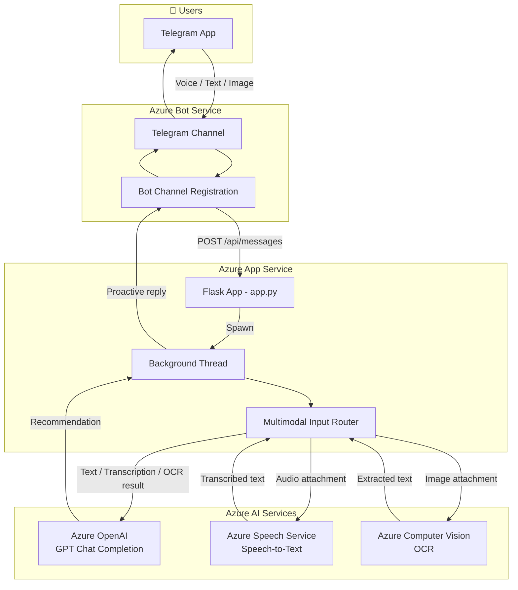

# Intelligent Book Recommendation Bot 📚

An intelligent, multimodal AI assistant that provides personalized book recommendations via Telegram. Built with Azure AI Services and Azure OpenAI, the bot supports text, voice, and image inputs.

## 🌟 Key Features

- **Multimodal Input**: 
  - 📝 **Text**: Ask for recommendations naturally (e.g., "Suggest me a mystery novel").
  - 🎙️ **Voice**: Send voice messages; the bot transcribes your speech using **Azure Speech Services**.
  - 📸 **Image**: Send a photo of a book cover; the bot extracts text using **Azure Computer Vision (OCR)** to find similar reads.
- **AI Brain**: Powered by **Azure OpenAI (GPT-3.5/4)** for context-aware, creative recommendations.
- **Rich Formatting**: Responses are enhanced with emojis and structured for easy reading in chat apps.
- **Proactive Messaging**: Handles long-running AI tasks in the background to avoid service timeouts.
- **CI/CD**: Automated deployment to **Azure App Service** via **GitHub Actions**.

## 🏗️ System Architecture

The following diagram illustrates the data flow from the user (Telegram) through Azure's ecosystem to the Flask backend and AI services.



## 🛠️ Tech Stack

- **Backend**: Python (Flask)
- **Bot Framework**: Microsoft Bot Framework SDK
- **AI Services**:
  - Azure OpenAI (GPT-3.5/GPT-4)
  - Azure AI Speech (Speech-to-Text)
  - Azure AI Vision (Computer Vision OCR)
- **Cloud Infrastructure**: 
  - Azure App Service (Web App)
  - Azure Bot Service
- **Deployment**: GitHub Actions

## 🚀 Getting Started

### Prerequisites

1. **Azure Subscription**: Access to Azure OpenAI, Speech Service, and Computer Vision.
2. **Telegram Bot**: Created via [@BotFather](https://t.me/botfather).
3. **Environment Variables**: Configure the following in your environment or `.env` file:

```env
# Azure OpenAI
AZURE_OPENAI_API_KEY=<your-key>
AZURE_OPENAI_ENDPOINT=<your-endpoint>
DEPLOYMENT_NAME=<your-model-deployment-name>

# Azure Bot Service
MicrosoftAppId=<your-app-id>
MicrosoftAppPassword=<your-app-password>
MicrosoftAppTenantId=<your-tenant-id>

# Azure AI Speech
AZURE_SPEECH_KEY=<your-speech-key>
AZURE_SPEECH_REGION=<e.g., eastus>

# Azure AI Vision
AZURE_CV_KEY=<your-vision-key>
AZURE_CV_ENDPOINT=<your-vision-endpoint>
```

### Local Setup

1. **Clone the repository**:
   ```bash
   git clone <repo-url>
   cd <repo-folder>
   ```

2. **Install dependencies**:
   ```bash
   pip install -r requirements.txt
   ```

3. **Run the application**:
   ```bash
   python app.py
   ```

4. **Expose to Web**: Use `ngrok` to expose your local port (8000) to the internet and update your Azure Bot Service messaging endpoint.
   ```bash
   ngrok http 8000
   ```

## 🚢 Deployment

The project is configured for CI/CD. Pushing to the `main` branch triggers the GitHub Action defined in `.github/workflows/main.yml`, which builds and deploys the application to your Azure App Service.

## 📄 License & Credits

Developed by **Aravindan Natarajan** with CC-BY-NC-SA 4.0 license.

